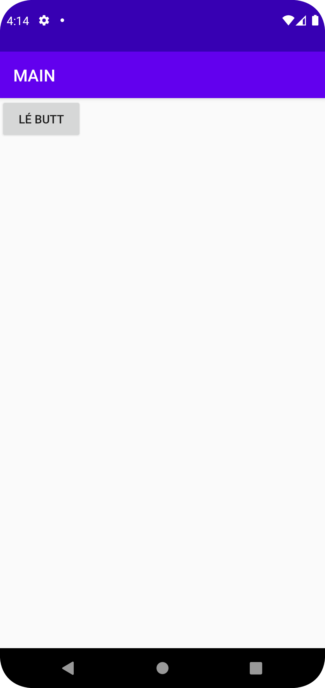
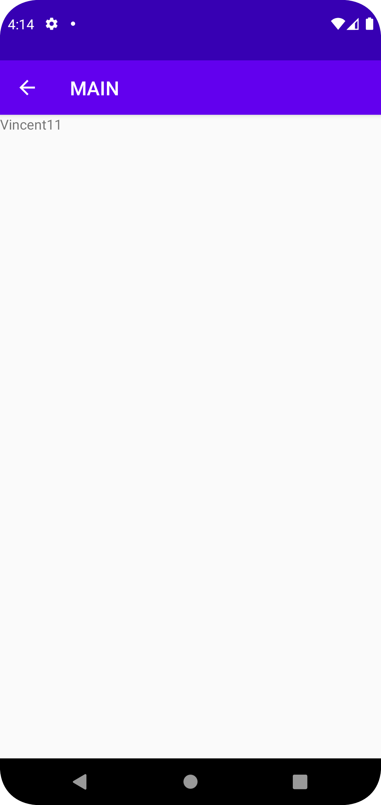

# Rapport

**Skriv din rapport här!**

_Du kan ta bort all text som finns sedan tidigare_.

## Följande grundsyn gäller dugga-svar:
1. skapde en knapp
2. adderade parent activity för Main
3. Adderade en textview för main2
4. Addera en ny string för textview i main2.
5. buttonclicker för att knappen ska fungera och värdena Vincent och 11 adderades i main.
6. kod som tar emott information i main2 och adderar en textview. 
```
1. <Button
        android:id="@+id/Newbtn"
        android:layout_width="100dp"
        android:layout_height="50dp"
        android:text="Lé Butt"
        />
        
     2.       android:parentActivityName=".MainActivity"/>

3. <TextView
        android:id="@+id/text2"   
        android:text="@string/app_name2"
        />
        
        
4. <string name="app_name2">Det var en fågel?</string>
 
 
 
5.  Button b = findViewById(R.id.Newbtn);
  
b.setOnClickListener(new View.OnClickListener() {
            @Override
            public void onClick(View view) {
            intent.putExtra("name", "Vincent");
                intent.putExtra("number", 11);
                
6.
    String name = extras.getString("name");
            int number = extras.getInt("number");
            // Do something with the name and number

            TextView text1 = findViewById(R.id.text2);
            text1.setText(name.concat(Integer.toString(number)));
```

Bilder läggs i samma mapp som markdown-filen.




Läs gärna:

- Boulos, M.N.K., Warren, J., Gong, J. & Yue, P. (2010) Web GIS in practice VIII: HTML5 and the canvas element for interactive online mapping. International journal of health geographics 9, 14. Shin, Y. &
- Wunsche, B.C. (2013) A smartphone-based golf simulation exercise game for supporting arthritis patients. 2013 28th International Conference of Image and Vision Computing New Zealand (IVCNZ), IEEE, pp. 459–464.
- Wohlin, C., Runeson, P., Höst, M., Ohlsson, M.C., Regnell, B., Wesslén, A. (2012) Experimentation in Software Engineering, Berlin, Heidelberg: Springer Berlin Heidelberg.
